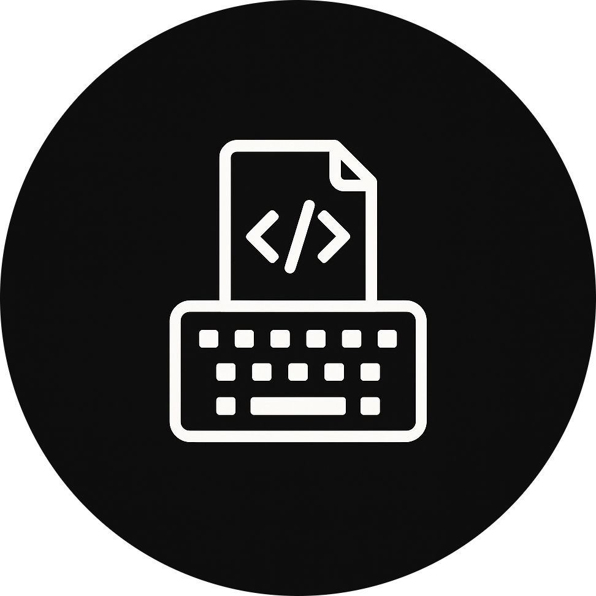

<!-- Icon -->

# Code Typer

Type actual code, not lorem ipsum. Code Typer features **10k+ real snippets** across **8 languages** (JS, TS, C, C++, C#, Java, Python, Lua) and lets you practice **real-world code** with brackets, quotes, tabs, and all the little characters that usually ruin your flow.

## ✨ Features

- **Real snippet pool** — Functions, classes, loops and more, all harvested from active open-source repos on GitHub.
- **Live feedback** — See WPM, accuracy, and a WPM-over-time graph the second you finish a snippet.
- **Editor-style shortcuts** — `Cmd/Ctrl + Backspace` deletes the line, `Alt + Backspace` goes to the previous word.
- **Auto-closing** — Auto-closing parentheses and brackets to simulate a real code editor experience.

## 🔧 Auto-closing Modes

Currently you can toggle between three different modes for the auto-closing.
| Mode | What happens |
| ------------ | ----------------------------------------------------- |
| **Full** | All brackets, parenthesis, quotation marks that are automatically closed when you type them and skipped when you reach them. |
| **Partial** | All brackets, parenthesis, quotation marks that are automatically closed when you type, but you actually need to type the closing character (or press the right arrow!) to move past it.
| **Disabled** | Nothing auto-completes; every bracket is on you. |

## 🧩 Tech Stack

- Next.js 15
- Tailwind
- Zustand
- Prisma + PostgreSQL
- Tree-sitter grammars (JS/TS/C/C++/C#/Java/Python/Lua)
- highlight.js
- Recharts

## 📄 License

This project is licensed under the MIT License. See the [LICENSE](https://github.com/mattiacerutti/code-typer/blob/main/LICENSE) file for details.
